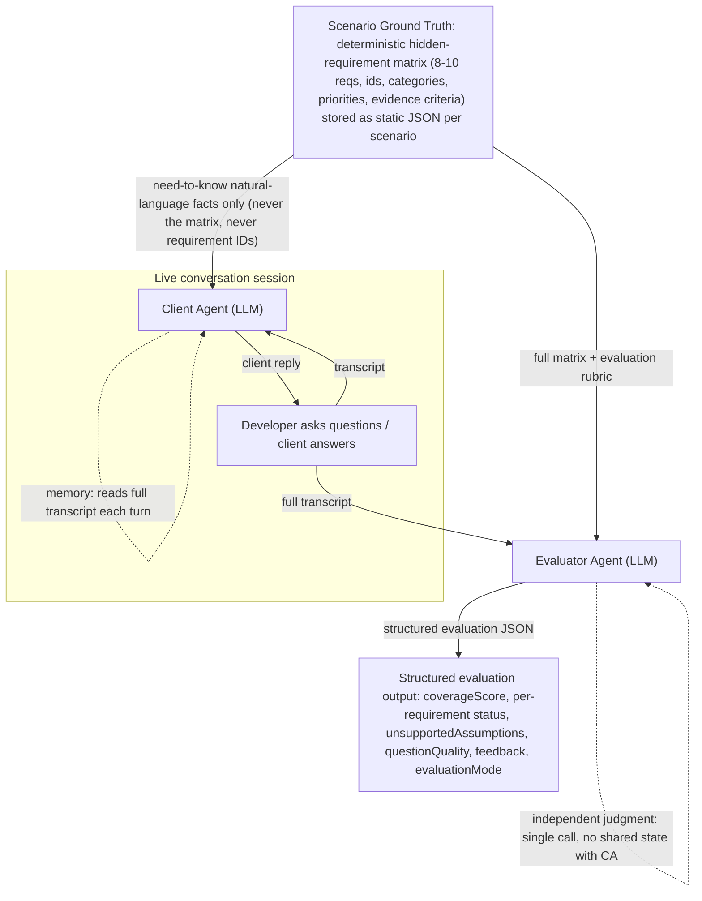
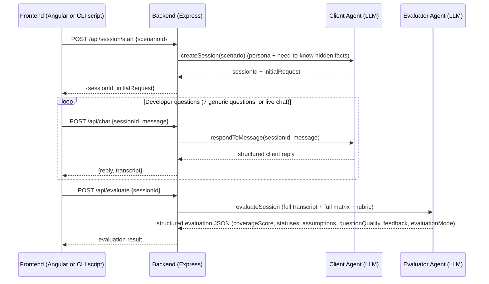

# SpecSim

SpecSim is an agentic requirements-discovery simulator: a two-agent system that
runs a realistic client stakeholder conversation and then, independently, judges
how well a developer uncovered hidden business requirements. Built for the
Agentic Workflows Hackathon.

## Problem: who has this problem, what's the bottleneck, why it matters

Requirements discovery is the first and most expensive failure point in software
delivery. A developer who asks the wrong questions - or misses the right ones -
builds the wrong system, and that error compounds through specification, coding,
and delivery. The bottleneck is not writing code but *discovering what the
business actually needs*: the hidden operational details (roles, permissions,
workflows, compliance, integrations) that a stakeholder will volunteer if asked
the right question and silently withhold if not.

The people who have this problem are the small-business owners purchasing their
first real business system. They do not speak in requirement IDs, acceptance
criteria, or entity-relationship models. They speak in operational pain: "we
keep missing expiry dates, double-counting stock, and the audit trail is shaky"
(pharmacy transcript, `pharmacy-management-system.json`). If the discovery phase
does not pull those details out, the system fails - and you only find out after
you have built the wrong thing.

## Solution

SpecSim pairs a Client Agent (an LLM playing a domain-specific business
stakeholder who only reveals hidden facts on-topic) with an Evaluator Agent (an
independent LLM judging the resulting conversation against a deterministic
ground-truth requirement matrix and an explicit rubric). It turns an otherwise
intangible skill - asking the right discovery questions - into a reproducible,
scored artifact: a transcript plus a structured evaluation with a coverage score,
per-requirement DISCOVERED / PARTIALLY_DISCOVERED / MISSED verdicts, a list of
unsupported assumptions, and a question-quality score.

## Agentic Architecture



What makes each agent *agentic*:
- **Client Agent - contextual memory**: every reply is generated with the full
  conversation transcript prepended to the prompt, so it remembers what it
  already said and answers consistently.
- **Client Agent - controlled reveal**: it is given only natural-language
  "need-to-know" facts (never the requirement matrix), so it cannot leak
  requirement IDs or evaluation ground truth into the conversation; it reveals a
  detail only when the developer's question is genuinely on-topic.
- **Evaluator Agent - independent judgment**: a separate LLM call (no shared
  state with the Client Agent) that reasons across the whole transcript against
  the complete matrix and rubric, and returns strict schema-validated JSON.

### Client Agent

Implemented in `server/services/client-agent.js` (system prompt builder in
`buildSystemPrompt`, conversation memory in a per-session transcript array).

Context it receives each turn:
- The persona: role, business context, communication style, goals, constraints,
  non-negotiables, and ambiguity points (`scenario.clientPersona`).
- A "need-to-know" natural-language digest of the hidden facts
  (`convertRequirementsToNaturalFacts`, `server/services/hidden-facts.js`).
- The full transcript so far.
- The developer's latest message.

Context it does NOT receive:
- The requirement IDs, categories, priority levels, statuses, or evaluation
  rubric. The system prompt forbids dumping structured data, asking the
  developer what to ask, and breaking character; it caps replies at
  `maxTokens: 500`.

### Evaluator Agent

Implemented in `server/services/evaluator-agent.js`. It is architecturally
independent: `evaluateTranscript` builds one prompt containing the full hidden
requirement matrix, the evaluation rubric, and the complete transcript, sends a
single LLM call (`temperature 0.1`), and validates the response against a schema
(`buildSchema`). Each requirement must be classified DISCOVERED,
PARTIALLY_DISCOVERED, or MISSED, and the result must include
`unsupportedAssumptions`, `questionQuality`, `coverageScore`, and `feedback`.

Every result carries an explicit `evaluationMode: "llm" | "fallback"` field. A
deterministic keyword-based fallback (`buildFallbackEvaluationResult`) exists
only for total model failure after two attempts - it is never used as a second
scoring path for a successful LLM call.

Independence from the Client Agent matters because the Client Agent is designed
to be *in* the story while the Evaluator Agent must be *out* of it. Sharing
state, a prompt template, or a context view between the two would let the
evaluator implicitly trust the client that produced the very transcript it is
judging.

### Why two agents, not one

A single LLM would have to simultaneously roleplay a client and objectively
judge the person talking to it, blurring the separation that makes the
evaluation meaningful - the judge would be measuring a performance it itself
delivered. Splitting the roles keeps the Client Agent's persona consistent and
the Evaluator Agent's judgment grounded in a ground truth the client never
directly exposes.

### Ground truth

Each scenario's hidden requirement matrix (8-10 requirements with id, name,
description, category, priority, and evidence criteria) is deterministic,
versioned JSON under `server/scenarios/<scenario-id>/hidden-requirements.json` -
not generated by either agent at runtime. It is the fixed benchmark both agents
operate on top of, which is what makes the evaluation reproducible.

## Baseline

The baseline is a single general-purpose LLM prompt with no specialized rubric,
no DISCOVERED / PARTIALLY_DISCOVERED / MISSED taxonomy, and no retry/fallback
sophistication - the kind of thing a developer would build with minimal effort.
It receives the same hidden requirement matrix and the same transcript as the
final pipeline, so the comparison is fair.

## Evaluation Method

**Primary metric: Requirement Discovery Coverage** - the percentage of hidden
requirements the developer's conversation actually surfaced, judged against the
deterministic ground truth.



## Results

Six scenarios were used (all listed in `experiments/baseline-vs-final/results.json`):
pharmacy-management-system, restaurant-pos, gym-management,
hospital-appointment-system, freelance-marketplace, and multi-branch-retail.
Each scenario's conversation was generated by running the same fixed set of 7
generic "thorough developer" questions (`scripts/run-scenario-conversation.js`)
through the real Client Agent, then evaluating the resulting transcript with both
the baseline and the final pipeline. A deliberately shallow weak-conversation
case was also run against multi-branch-retail.

| Scenario | Hidden reqs | Baseline score | Final coverageScore | Delta |
| --- | ---: | ---: | ---: | ---: |
| pharmacy-management-system | 9 | 67 | 72 | +5 |
| restaurant-pos | 9 | 75 | 89 | +14 |
| gym-management | 9 | 85 | 100 | +15 |
| hospital-appointment-system | 9 | 85 | 89 | +4 |
| freelance-marketplace | 9 | 45 | 33 | -12 |
| multi-branch-retail | 10 | 70 | 80 | +10 |
| multi-branch-retail (weak/shallow conversation) | 10 | 0 | 0 | 0 |

- Average baseline score: 71.17
- Average final coverage score: 77.17
- Baseline outputs that failed to parse as clean JSON: 0
- Final outputs with valid `evaluationMode: "llm"`: 6 of 6

**freelance-marketplace was the one regression (-12).** The developer derailed
the conversation into pharmacy inventory and POS territory (see
`results.json`), partly because the fixed 7 questions are tuned for operational
retail businesses, not for a trust/reputation-driven marketplace. This is our
most useful data point - see the Hot Take.

**Weak transcript:** the multi-branch-retail weak case (a UI-only conversation:
"what should the UI look like?", "can we just make it modern, simple, and easy?")
scored 0 under both pipelines, confirming the evaluator does not inflate scores
when no real discovery happens.

## Improvement Changelog

See [CHANGELOG.md](./CHANGELOG.md) for the full iteration-by-iteration history
(baseline design, client agent evolution, evaluator redesigns, the Groq-to-Gemini
migration, and more).

## Main Failure Mode

The single biggest reliability issue was **silent degradation to a lower-quality
result without it being obvious**. Three concrete manifestations occurred:

1. **Truncated LLM responses** that finished mid-JSON. These were treated as
   partial successes until the truncation path was made an explicit retryable
   error with a larger token budget.
2. **A keyword-based fallback** that could produce plausible-looking (but
   non-agentic) scores when the real model call failed.
3. **Provider quota exhaustion that produced transcripts literally full of
   "All Groq models failed" text** while the batch script, skipping work it
   believed was already complete, still produced a `results.json` that looked
   finished. This was caught by reading raw transcript files, not by any
   automated check.

All three were addressed by making degraded output explicit: every evaluation
carries `evaluationMode: "llm" | "fallback"`, truncation is a retryable
condition, and the batch resume logic only skips a scenario if both baseline and
final have `evaluationMode: "llm"` - not merely if a result "exists".

## Hot Take

A generic question script makes the *system* look broken when it is really the
*bucket of scenarios* that is misfit - and nothing in a single-evaluator
architecture surfaces that on its own. On freelance-marketplace the final
pipeline scored 33 vs the baseline's 45: the same fixed questions ("what
reporting do you need?", "what other tools does this need to work with?") work
for businesses with physical inventory and cash reconciliations and fail for a
trust/reputation marketplace whose hidden requirements (escrow, dispute
handling, reputation mechanisms) need domain-specific prompts. The system never
told us this was happening; it just returned a lower number. The lesson: an
evaluation pipeline built on a single fixed interview script must either pair
the script with domain-aware question generation or explicitly label the run as
"generic-question mode," because the generic script does not transfer evenly
across domains and nothing in the architecture flags the mismatch by itself.

## Reproduction Guide

### Requirements
- Node.js 18+ (tested with Node 22)
- npm
- An LLM API key, free tier, either:
  - **Groq** (`LLM_PROVIDER=groq`) for the Groq path, or
  - **Google Gemini** (`LLM_PROVIDER=gemini`) - the provider used for the final
    batch run in `results.json`.

### Setup
```bash
npm install
cd frontend && npm install && cd ..
cp .env.example .env
# Edit .env with your key, e.g.:
# LLM_PROVIDER=gemini
# LLM_API_KEY=<your-key>
# LLM_MODEL=gemini-3.6-flash
# LLM_BASE_URL=https://generativelanguage.googleapis.com/v1beta/openai
```

`.env.example` current shape:
```
LLM_PROVIDER=groq
LLM_API_KEY=<your-key>
LLM_MODEL=<model-name>
LLM_BASE_URL=
```

### Run the app (API + Angular UI)
```bash
# Terminal 1 - backend API
node server/app.js          # listens on port 3000

# Terminal 2 - Angular dev server
cd frontend && npm start    # serves the UI on port 4200, proxies /api to 3000
```

Open http://localhost:4200. The welcome screen offers difficulty-filtered
scenario cards; choosing one starts the interview, which sends messages to
`POST /api/chat` and evaluates on `POST /api/evaluate`.

### Run the baseline vs final comparison for one scenario
```bash
# 1) Generate a transcript via the real Client Agent
node scripts/run-scenario-conversation.js <scenario-id>

# 2) Evaluate it with the baseline (generic single-prompt pipeline)
node scripts/run-baseline.js experiments/baseline-vs-final/transcripts/<scenario-id>.json <scenario-id>

# 3) Evaluate it with the final pipeline
node scripts/run-final.js experiments/baseline-vs-final/transcripts/<scenario-id>.json <scenario-id>
```

### Run the full batch and regenerate the report
```bash
node scripts/run-all-experiments.js
node scripts/generate-report.js
```

### Expected output
- `experiments/baseline-vs-final/transcripts/<scenario-id>.json` - the raw
  developer/client conversation.
- `experiments/baseline-vs-final/results.json` - per-scenario baseline and final
  evaluations, each tagged with `evaluationMode`.
- `experiments/baseline-vs-final/report.md` - the comparison table.

### Runtime and cost
Each scenario (conversation + baseline + final evaluation) takes roughly 1-2
minutes on the free tier due to intentional rate-limit pacing. All testing used
free-tier keys (Groq and Google AI Studio / Gemini) - **$0 cost**.

## Scenario Management

Scenario CRUD is implemented and verified:

- **Bulk:`scripts/generate-scenarios.js`** generates the original scenario
  folders from the internal generator (this produced the 6 experiment scenarios,
  plus the additional standalone scenarios).
- **API** (`server/routes/scenarios.js`): `GET /api/scenarios` (list with title,
  description, difficulty, initialRequest), `GET /api/scenarios/:id`,
  `POST /api/scenarios` (create), `PUT /api/scenarios/:id` (update), and
  `DELETE /api/scenarios/:id`. Scenarios are stored as versioned JSON files per
  folder (`server/scenario-store.js` writes `scenario.json`,
  `hidden-requirements.json`, `client-persona.json`, `evaluation-rubric.json`).
- **Validation** (`server/scenario-schema.js`): new scenarios must include 8-10
  hidden requirements, each with `id`, `name`, `description`, `category`,
  `priority`, and `evidenceCriteria`.
- **Delete protection**: `DELETE` returns 400 if the `scenarioId` appears in
  `experiments/baseline-vs-final/results.json` or `.batch-checkpoint.json`, so
  experiment results cannot be silently invalidated.
- **UI** (`frontend/src/app/scenario-manager.*`): an Angular "Manage" screen
  lists scenarios, supports create/edit/delete and difficulty assignment, and
  can import scenarios from an .xlsx/.csv spreadsheet (one row per hidden
  requirement, grouped by `scenario_id`) via `POST /api/scenarios/import`.

**Note on `crime-investigation`:** an extra draft scenario lives under
`server/scenarios/crime-investigation/` (8 requirements, difficulty hard). It is
not part of the experiment batch and has a mojibake character in its description.

## Limitations

- A **single fixed script of 7 generic questions** drives the transcripts (and
  the live UI uses a fixed interview flow), not domain-adaptive question
  generation. The freelance-marketplace regression shows the practical cost.
- The **live UI chat relies on a curated question flow**; the pharmacy *final*
  transcript (`pharmacy-6-question.json`) is a hand-curated 6-question dialog,
  while every other scenario used the same generated 7-question transcript for
  both baseline and final - so the pharmacy +5 is not a like-for-like
  comparison the way the other five are.
- **`server/services/hidden-facts.js` maps the pharmacy scenario's natural
  facts by requirement id.** Because every scenario uses the REQ-001..REQ-009
  ids, non-pharmacy scenarios (restaurant-pos, gym, hospital,
  freelance-marketplace, multi-branch-retail) currently receive
  pharmacy-flavored "need-to-know" facts. The persona still describes the
  correct domain, but the hidden facts can contradict it - the most likely cause
  of the freelance-marketplace derailment. A new scenario whose ids fall outside
  REQ-001..REQ-009 falls back to `requirement.description`.
- The **fallback evaluator** is a deterministic keyword matcher; it exists only
  for total model failure, but when it fires it is not a comparable measurement.
- **Free-tier daily token quotas** can interrupt long batch runs; the scripts
  support `--resume` but only skip scenarios where both entries carry
  `evaluationMode: "llm"`.
- Frontend unit testing via `@angular/build:unit-test` requires additional
  vitest browser drivers not installed in the default setup.